# Screen Documentation – Student Scholarship System

## Home Page
Introduces the system with a clear purpose and CTA.

## Login Screen
Simple login form with email and password fields.
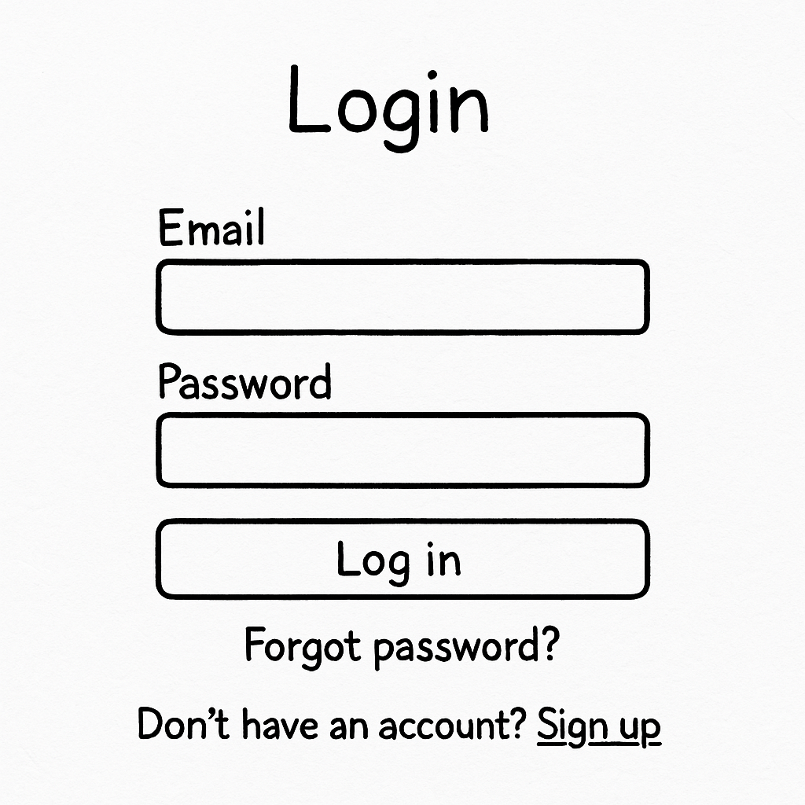

## Sign-Up Screen
Form for new users to create an account.
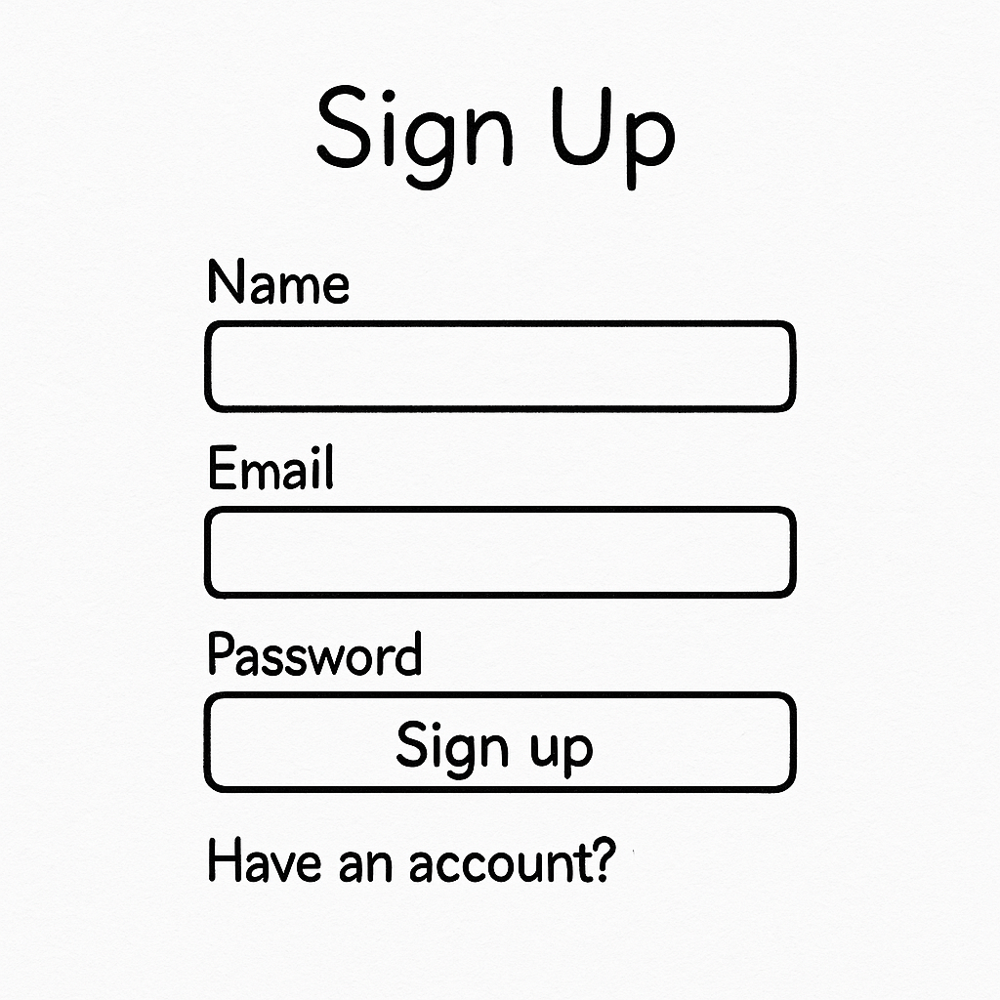

## Marketing/Intro Screen
A short explanation and invitation to start using the system.

## Criteria Form
Form for users to enter academic and personal details.
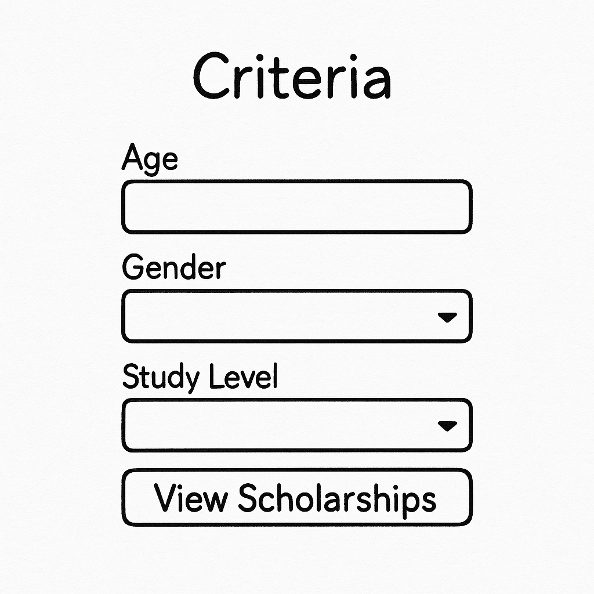

## Scholarships Results
List of matched scholarships with filters and search.
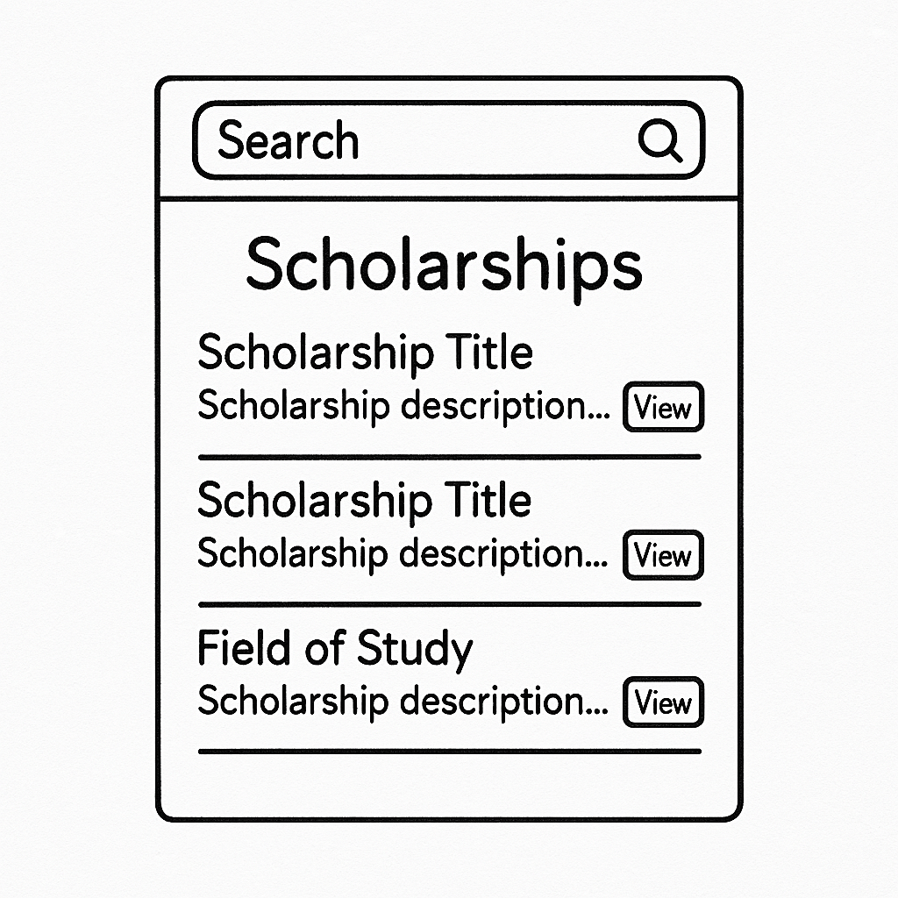

## Profile Page
Displays user information and saved preferences.
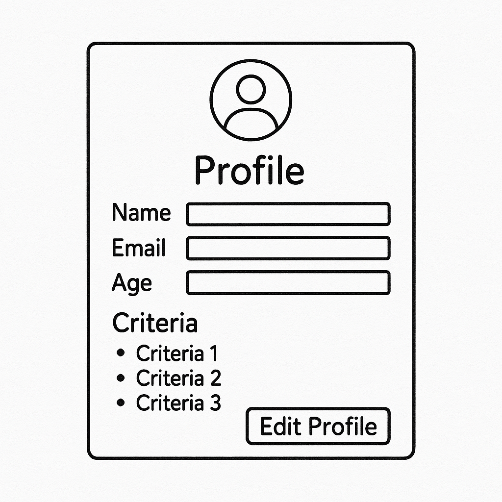

## Help & Settings
Contains FAQ, contact, and personal settings.
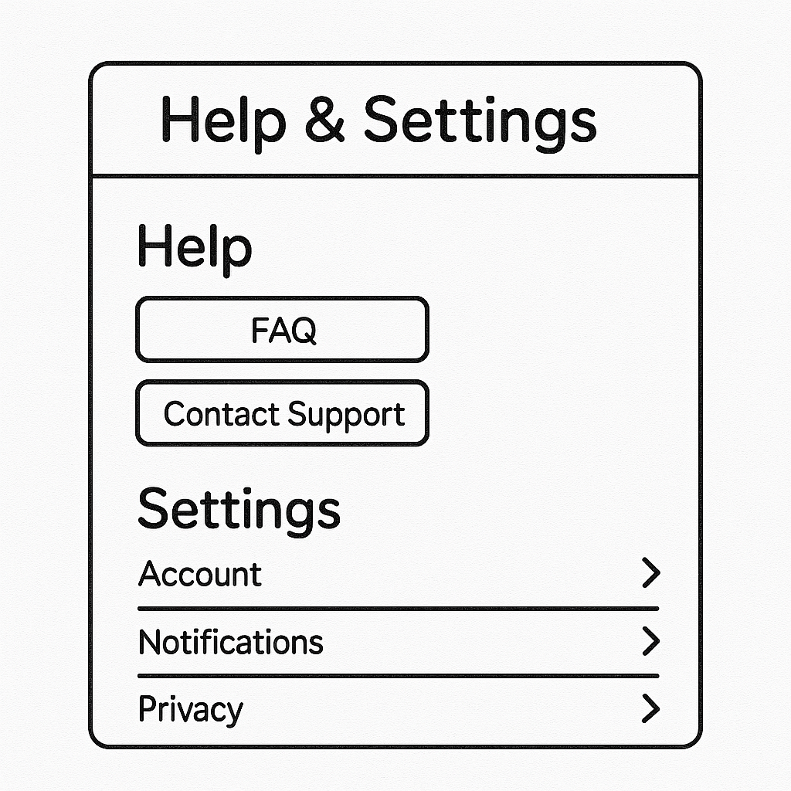

## Admin – Scholarship Management
Admin screen with list of scholarships, and edit/delete options.
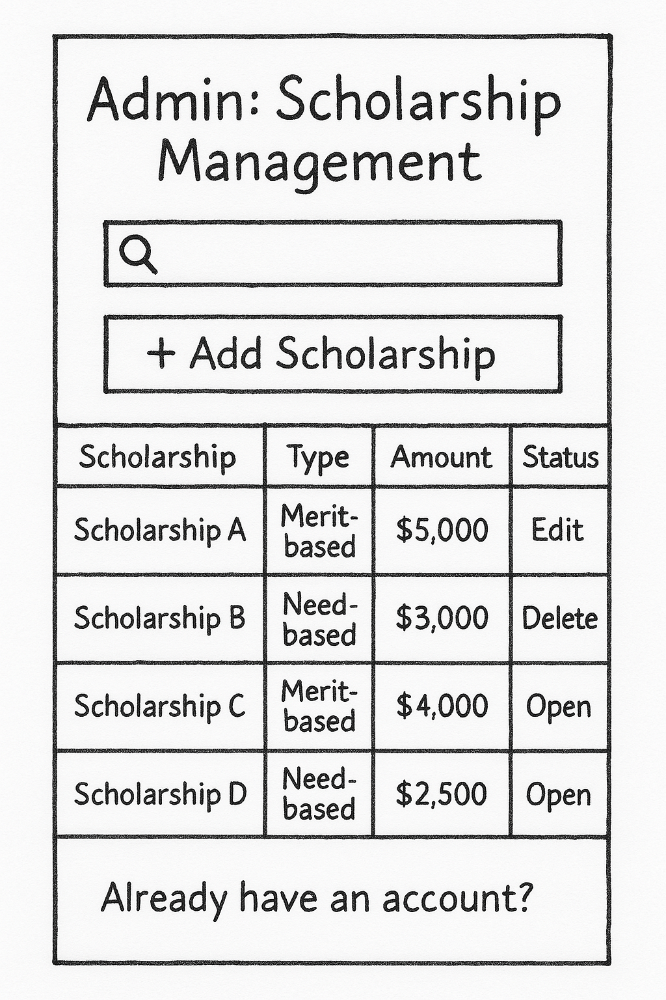

## Admin Dashboard
Displays key performance indicators and charts.
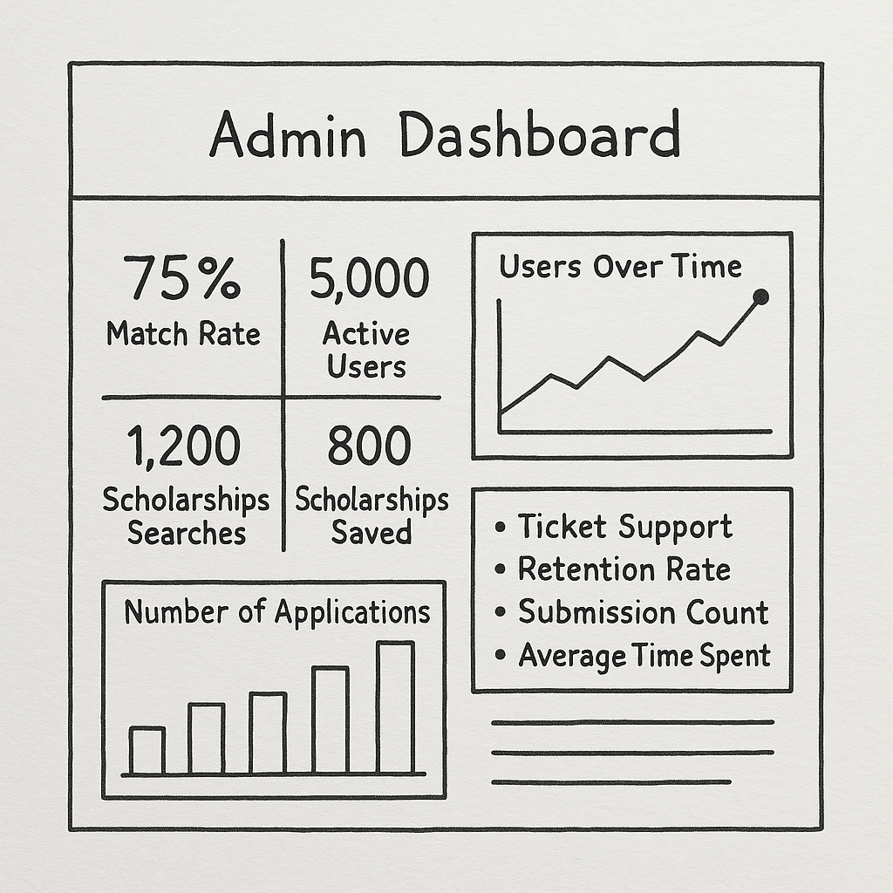

## Navigation Flow (Detailed)
A full user flow diagram showing all paths.
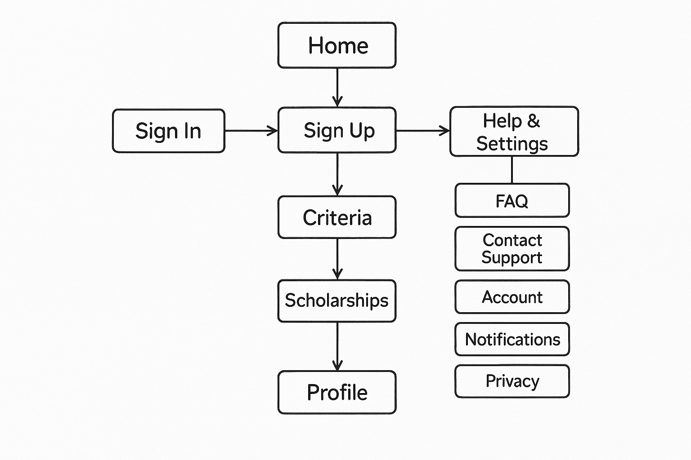

## Navigation Flow (Simplified)
Basic overview of main user journey.
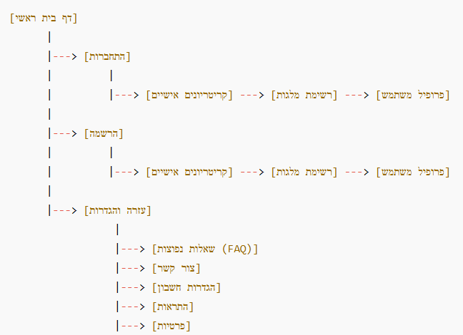

## Forms Overview
A visual table of all forms and fields in the system.
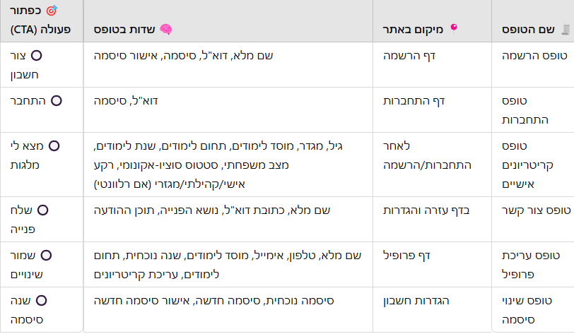
